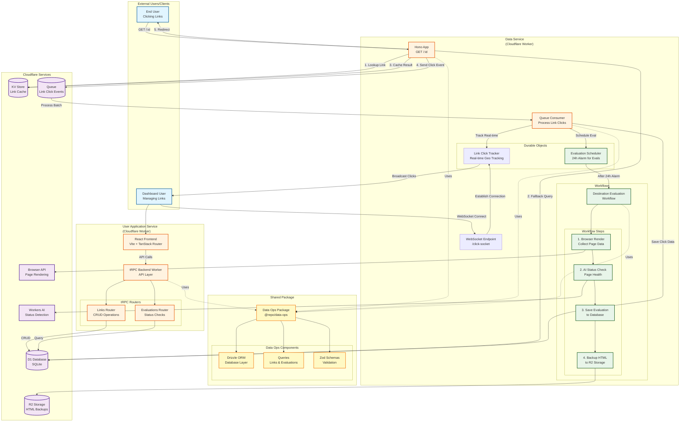
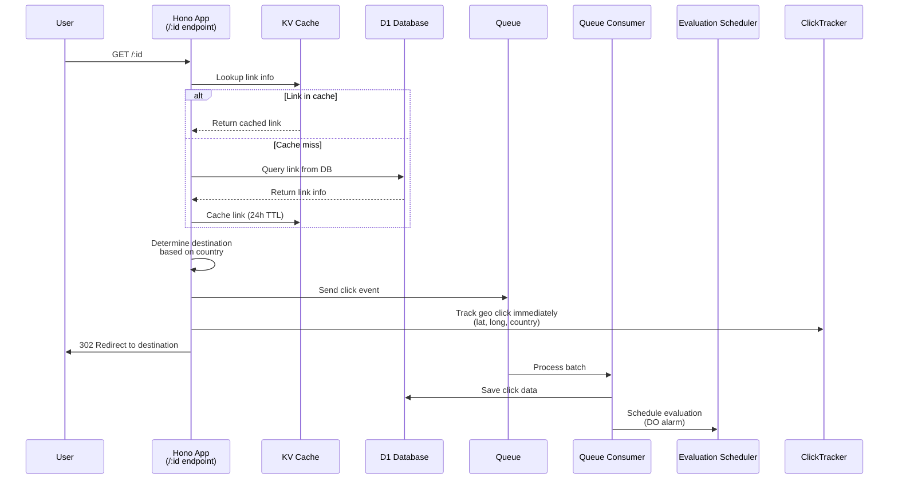
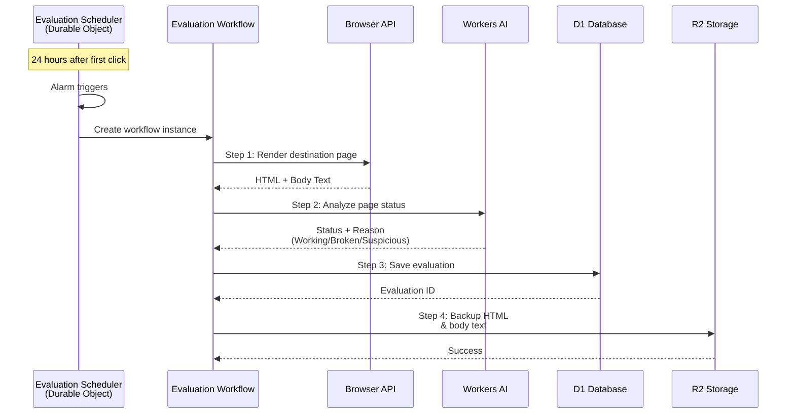
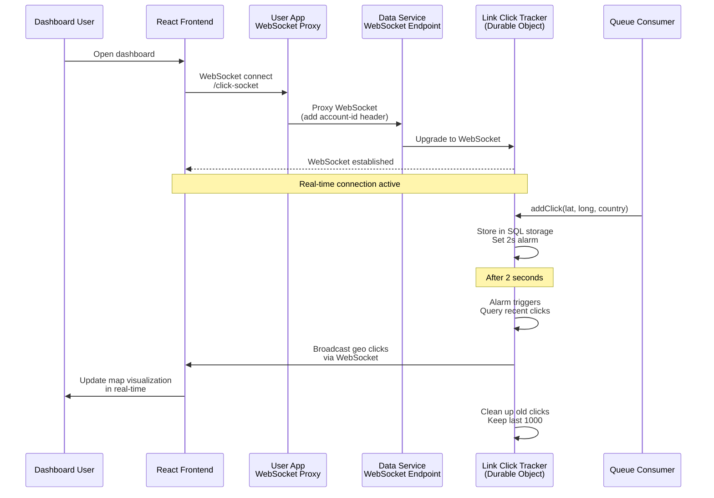
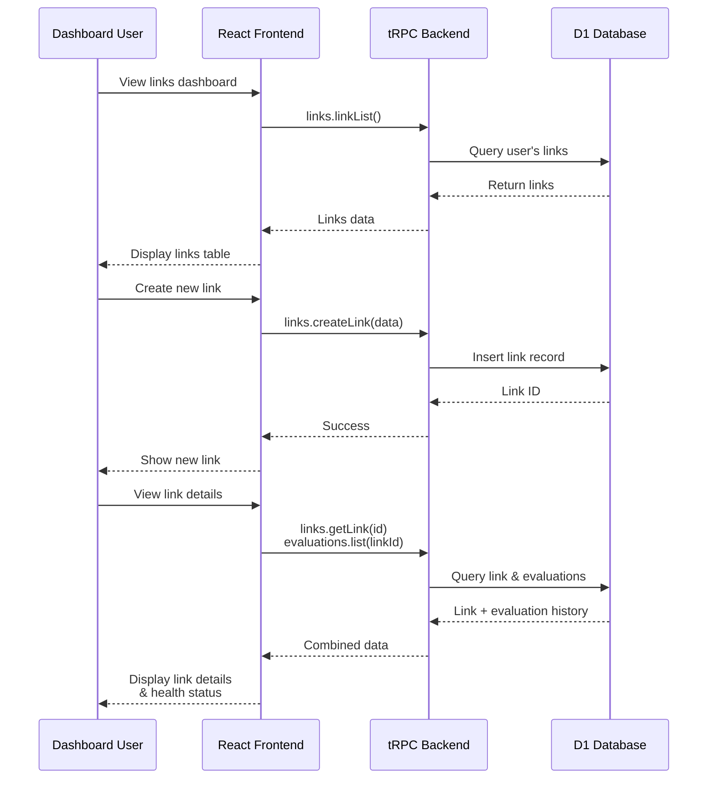

# Zitly Architecture Diagram

## System Overview

This document visualizes the architecture and data flow of the Zitly URL shortening and routing service.

**Key Features:**

- Geographic-based link routing
- Real-time click tracking via WebSocket
- Automated destination health monitoring
- AI-powered link evaluation
- Multi-environment deployment support

**Recent Updates:**

- ✨ **Real-Time Click Tracking**: WebSocket integration for live geographic click visualization (Oct 2025)
- 🚀 **Staging Environment**: Multi-environment deployment configuration with dedicated staging setup
- 🔗 **Remote Bindings**: Development environment now uses remote Browser API and Workers AI for testing
- 📊 **Link Click Tracker DO**: New Durable Object for real-time geo-location aggregation with SQL storage
- 🔄 **Dual-Path Processing**: Immediate real-time updates alongside persistent queue-based storage

## Architecture Diagram



## Data Flow Sequences

### 1. Link Click Flow



### 2. Destination Evaluation Flow



### 3. Real-Time Click Tracking Flow



### 4. Dashboard User Flow



## Component Details

### Data Service (apps/data-service)

- **Purpose**: Handles link redirects and destination monitoring
- **Technology**: Cloudflare Worker with Hono framework
- **Key Features**:
  - Geographic routing (country-based destinations)
  - Link click tracking via queues
  - Real-time click tracking via WebSocket
  - Automated destination health checks (24h intervals)
  - Browser rendering for page analysis
  - AI-powered status detection
- **Durable Objects**:
  - **Link Click Tracker**: Stores recent geo-location clicks in SQL storage, broadcasts to connected WebSocket clients every 2 seconds
  - **Evaluation Scheduler**: Manages 24-hour evaluation alarms for each link-destination pair

### User Application (apps/user-application)

- **Purpose**: Dashboard for managing links and viewing analytics
- **Technology**: React (Vite) + tRPC backend worker
- **Key Features**:
  - Link CRUD operations
  - Real-time analytics dashboard with WebSocket integration
  - Live geographic click visualization
  - Evaluation history viewer
  - Geographic click distribution
- **Real-Time Features**:
  - WebSocket proxy endpoint (`/click-socket`) that forwards connections to Data Service
  - Zustand store for managing real-time click state (max 1000 clicks)
  - Automatic reconnection with exponential backoff (max 5 retries)

### Data Ops Package (packages/data-ops)

- **Purpose**: Shared database layer and schemas
- **Technology**: Drizzle ORM + Zod
- **Provides**:
  - Database abstractions
  - Type-safe queries
  - Validation schemas
  - Reusable data operations

## Storage Architecture

### D1 Database

- Primary data store
- Stores: links, destinations, clicks, evaluations
- Shared between both services

### KV Store

- Link metadata cache (24h TTL)
- Reduces D1 queries for hot links
- Improves redirect latency

### R2 Storage

- Long-term storage for evaluation artifacts
- Organized by: `evaluations/{accountId}/{html|body-text}/{evaluationId}`

### Queue

- Asynchronous click processing
- Decouples redirect from analytics
- Named: `zitly-data-queue-stage`

### Durable Object SQL Storage

**Link Click Tracker** uses Durable Object SQL storage for:

- Temporary storage of recent geo-clicks (latitude, longitude, country, timestamp)
- Fast queries for real-time aggregation
- Automatic cleanup to maintain only relevant recent data
- Schema:
  ```sql
  CREATE TABLE geo_link_clicks (
      latitude REAL NOT NULL,
      longitude REAL NOT NULL,
      country TEXT NOT NULL,
      time INTEGER NOT NULL
  )
  ```

## Deployment Architecture

### Environments

The application supports multiple deployment environments:

- **Development**: Local development with `wrangler dev --x-remote-bindings`
- **Staging**: Pre-production testing environment
- **Production**: Live production environment

### Deployment Scripts

Both services include staging deployment commands:

```bash
# Data Service
npm run stage:deploy  # wrangler deploy --env stage

# User Application
npm run stage:deploy  # npm run build && wrangler deploy
```

### Remote Bindings

Data Service development mode uses `--x-remote-bindings` flag to access:

- Browser API for page rendering
- Workers AI for status detection
- Remote D1 database
- Remote R2 storage

This ensures development environment matches production behavior.

## Key Design Patterns

1. **Service Bindings**: Both workers share the same D1 database
2. **Monorepo Structure**: Shared code via `@repo/data-ops` package
3. **Cache-Aside Pattern**: KV cache with D1 fallback
4. **Event-Driven**: Queue-based click processing
5. **Durable Objects**: Stateful scheduling and real-time tracking with alarms
6. **Workflows**: Multi-step orchestration for evaluations
7. **WebSocket Communication**: Real-time click tracking with automatic reconnection
8. **Edge Computing**: All services run on Cloudflare's edge network
9. **Dual-Path Click Processing**:
   - **Fast Path**: Immediate geo-click tracking to Click Tracker DO for real-time updates
   - **Slow Path**: Queued processing for persistent storage in D1 and evaluation scheduling
   - This ensures dashboard users see clicks instantly while maintaining data integrity

## Scaling Considerations

- **Geographic Distribution**: Workers deployed globally
- **Automatic Scaling**: Cloudflare handles traffic spikes
- **Durable Objects**:
  - Evaluation Scheduler: Unique per link-destination pair
  - Click Tracker: One per account for real-time aggregation
- **Queue Batching**: Processes clicks in batches
- **Workflow Retries**: Built-in retry logic for each step
- **Cache Layer**: Reduces database load for popular links
- **WebSocket Scaling**: Each Durable Object maintains WebSocket connections per account
- **Data Retention**: Click Tracker maintains only recent 1000 clicks in memory for real-time streaming
